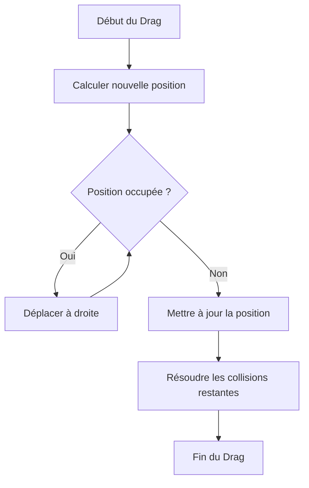

# Gestion des Collisions

Ce document explique comment la gestion des collisions est implémentée dans notre grille.

## Schéma de Gestion des Collisions

## Explication des Étapes

1. **Début du Drag**: L'utilisateur commence à déplacer une tuile.
2. **Calculer nouvelle position**: La nouvelle position de la tuile est calculée en fonction du déplacement.
3. **Position occupée ?**: Vérifie si la nouvelle position est déjà occupée par une autre tuile.
4. **Déplacer à droite**: Si la position est occupée, la tuile est déplacée vers la droite jusqu'à trouver une position libre.
5. **Mettre à jour la position**: La position de la tuile est mise à jour avec la nouvelle position libre.
6. **Résoudre les collisions restantes**: Vérifie et résout les collisions restantes en ajustant les positions des autres tuiles si nécessaire.
7. **Fin du Drag**: Le déplacement de la tuile est terminé.

## Méthodes Utilisées

- **isTilePositionOccupied**: Vérifie si une position est occupée par une autre tuile.
- **resolveCollisions**: Ajuste les positions des tuiles pour s'assurer qu'il n'y a pas de chevauchement.
- **handleDragStart / handleDragEnd / handleDragMove**: Gèrent les événements de glisser-déposer pour mettre à jour les positions des tuiles.
