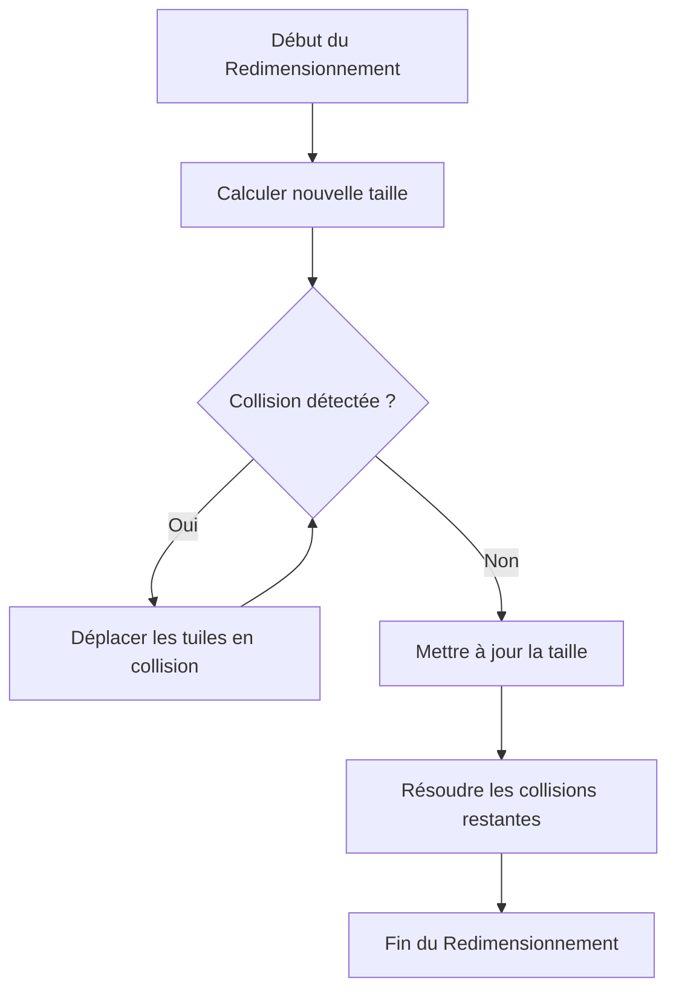

# Gestion du Changement de Taille d'une Tuile

Ce document explique comment la gestion du changement de taille d'une tuile est implémentée dans notre grille.

## Schéma de Gestion du Changement de Taille

## Explication des Étapes

1. **Début du Redimensionnement**: L'utilisateur commence à redimensionner une tuile.
2. **Calculer nouvelle taille**: La nouvelle taille de la tuile est calculée en fonction de la direction de redimensionnement.
3. **Collision détectée ?**: Vérifie si la nouvelle taille de la tuile entraîne une collision avec une autre tuile.
4. **Déplacer les tuiles en collision**: Si une collision est détectée, les tuiles en collision sont déplacées pour libérer de l'espace.
5. **Mettre à jour la taille**: La taille de la tuile est mise à jour avec la nouvelle taille.
6. **Résoudre les collisions restantes**: Vérifie et résout les collisions restantes en ajustant les positions des autres tuiles si nécessaire.
7. **Fin du Redimensionnement**: Le redimensionnement de la tuile est terminé.

## Méthodes Utilisées

- **isTilePositionOccupied**: Vérifie si une position est occupée par une autre tuile.
- **resolveCollisions**: Ajuste les positions des tuiles pour s'assurer qu'il n'y a pas de chevauchement.
- **handleEnlargeTile**: Gère le redimensionnement des tuiles en modifiant leur largeur et/ou hauteur.
