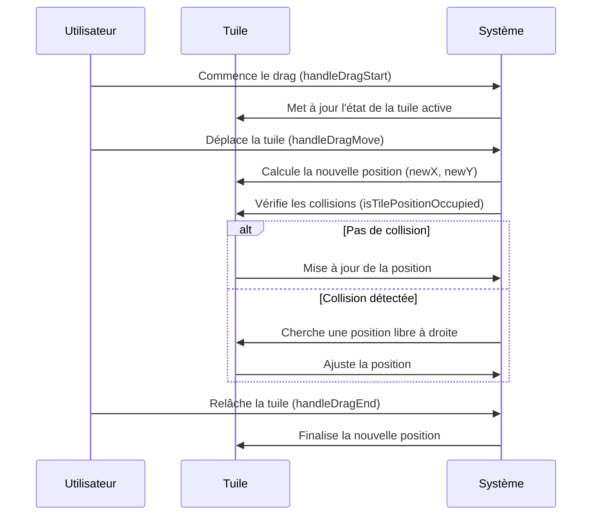
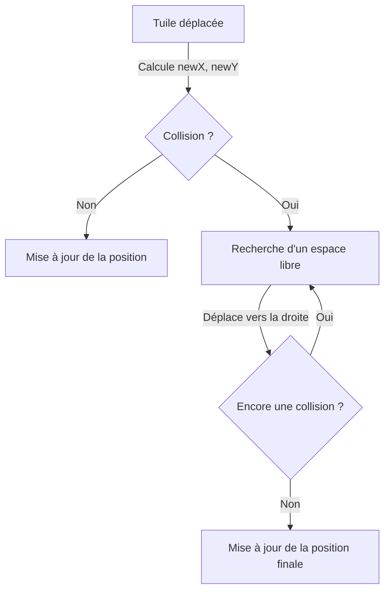
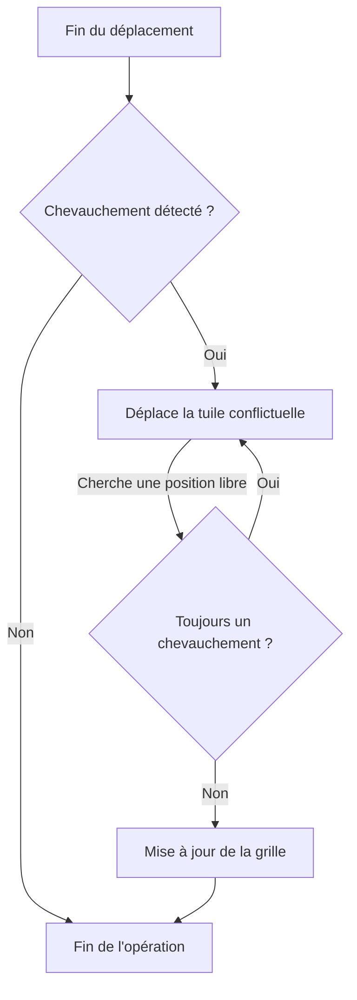

Voici des diagrammes **Mermaid** détaillant le déplacement d'une tuile et la gestion des collisions.

---

### **1. Déplacement d'une tuile**
Ce diagramme montre comment une tuile se déplace de `(x, y)` à `(newX, newY)`.

---

### **2. Gestion des collisions lors du déplacement**
Ce diagramme illustre comment une collision est détectée et résolue en déplaçant la tuile vers la droite.

---

### **3. Résolution automatique des conflits**
Ce diagramme montre comment le système ajuste les tuiles en cas de chevauchement après un déplacement.

Ces schémas aident à visualiser **le processus de déplacement et la gestion des collisions** de manière fluide et efficace. 🚀