Voici des diagrammes **Mermaid** détaillant le déplacement d'une tuile et la gestion des collisions.

---

### **1. Déplacement d'une tuile**
Ce diagramme montre comment une tuile se déplace de `(x, y)` à `(newX, newY)`.

```mermaid
sequenceDiagram
    participant Utilisateur
    participant Tuile
    participant Système

    Utilisateur->>Système: Commence le drag (handleDragStart)
    Système->>Tuile: Met à jour l'état de la tuile active
    Utilisateur->>Système: Déplace la tuile (handleDragMove)
    Système->>Tuile: Calcule la nouvelle position (newX, newY)
    Système->>Tuile: Vérifie les collisions (isTilePositionOccupied)
    alt Pas de collision
        Tuile->>Système: Mise à jour de la position
    else Collision détectée
        Système->>Tuile: Cherche une position libre à droite
        Tuile->>Système: Ajuste la position
    end
    Utilisateur->>Système: Relâche la tuile (handleDragEnd)
    Système->>Tuile: Finalise la nouvelle position
```

---

### **2. Gestion des collisions lors du déplacement**
Ce diagramme illustre comment une collision est détectée et résolue en déplaçant la tuile vers la droite.

```mermaid
graph TD;
    A[Tuile déplacée] -->|Calcule newX, newY| B{Collision ?}
    B -- Non --> C[Mise à jour de la position]
    B -- Oui --> D[Recherche d'un espace libre]
    D -->|Déplace vers la droite| E{Encore une collision ?}
    E -- Oui --> D
    E -- Non --> F[Mise à jour de la position finale]
```

---

### **3. Résolution automatique des conflits**
Ce diagramme montre comment le système ajuste les tuiles en cas de chevauchement après un déplacement.

```mermaid
graph TD;
    A[Fin du déplacement] --> B{Chevauchement détecté ?}
    B -- Non --> C[Fin de l'opération]
    B -- Oui --> D[Déplace la tuile conflictuelle]
    D -->|Cherche une position libre| E{Toujours un chevauchement ?}
    E -- Oui --> D
    E -- Non --> F[Mise à jour de la grille]
    F --> C
```

Ces schémas aident à visualiser **le processus de déplacement et la gestion des collisions** de manière fluide et efficace. 🚀